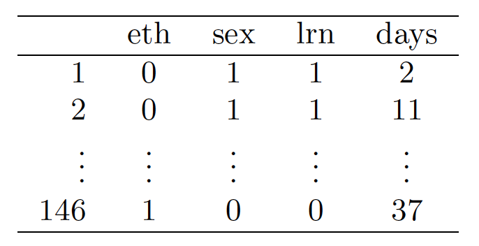

```{r setup, include=FALSE}
knitr::opts_chunk$set(echo = TRUE)
```

#MULTIPLE AND LOGISTIC REGRESSION

**8.2 Baby weights, Part II.** Exercise 8.1 introduces a data set on birth weight of babies.
Another variable we consider is parity, which is 0 if the child is the first born, and 1 otherwise.
The summary table below shows the results of a linear regression model for predicting the average
birth weight of babies, measured in ounces, from parity.


(a) Write the equation of the regression line.

$\hat{y}=120.7 - 1.93*parity$

(b) Interpret the slope in this context, and calculate the predicted birth weight of first borns and
others.

The slope tells as that there is a decrease of 1.93 ounces in the baby's weight for a parity of one. That is the baby's weight is 1.93 lower if it is not a first born.

```{r}
first_born_weigth<-120.7-1.93*0
first_born_weigth

non_first_born_weigth<-120.7-1.93*1
non_first_born_weigth
```

(c) Is there a statistically significant relationship between the average birth weight and parity?

We look at the p-value to see if it is small enough, less than 0.05. We find it to be 0.1052, so we conclude that the relationship is not statistically significant.


**8.4 Absenteeism.** Researchers interested in the relationship between absenteeism from school
and certain demographic characteristics of children collected data from 146 randomly sampled students
in rural New South Wales, Australia, in a particular school year. Below are three observations
from this data set.



The summary table below shows the results of a linear regression model for predicting the average
number of days absent based on ethnic background (eth: 0 - aboriginal, 1 - not aboriginal), sex
(sex: 0 - female, 1 - male), and learner status (lrn: 0 - average learner, 1 - slow learner).


(a) Write the equation of the regression line.

$\hat{y} = 18.93−9.11×eth+3.10×sex+2.15×lrn$

(b) Interpret each one of the slopes in this context.

eth indicates that all else being equal there is a 9.11 absent days reduction when the individual is not aboriginal.

sex indicates that all else being equal there is a 3.10 absent days reduction when the individual is male.

lrn indicates that all else being equal there is a 2.15 absent days increase when the individual is a slow learner.

(c) Calculate the residual for the first observation in the data set: a student who is aboriginal,
male, a slow learner, and missed 2 days of school.

As calculated below, the residual is -22.18

```{r}
eth<-0 # aboriginal
sex<-1 # male
lrn<-1 # slow Learner
missed_days<-2 #actual missed days

predicted_days<-18.93-9.11*eth+3.1*sex+2.15*lrn

residual<-missed_days-predicted_days
residual
```

(d) The variance of the residuals is 240.57, and the variance of the number of absent days for all
students in the data set is 264.17. Calculate the R2 and the adjusted R2. Note that there are
146 observations in the data set.


```{r}
n<-146 
k<-3   
variance_residual<-240.57
variance_all_students<-264.17

R2<-1-(variance_residual/variance_all_students)
R2
aR2 <-1-(variance_residual/variance_all_students)*((n-1)/(n-k-1))
aR2
```

**8.8 Absenteeism, Part II.** Exercise 8.4 considers a model that predicts the number of days
absent using three predictors: ethnic background (eth), gender (sex), and learner status (lrn).
The table below shows the adjusted R-squared for the model as well as adjusted R-squared values
for all models we evaluate in the first step of the backwards elimination process.


Which, if any, variable should be removed from the model first?

We look for the highest $R^2$ after eliminating a variable, in this case it is shown to be learner status. By doing so, our model $R^2$ will increase from 0.0701 with all the variables, to 0.0723 with the learner status variable removed.

**8.16 Challenger disaster, Part I**. On January 28, 1986, a routine launch was anticipated for
the Challenger space shuttle. Seventy-three seconds into the flight, disaster happened: the shuttle
broke apart, killing all seven crew members on board. An investigation into the cause of the
disaster focused on a critical seal called an O-ring, and it is believed that damage to these O-rings
during a shuttle launch may be related to the ambient temperature during the launch. The table
below summarizes observational data on O-rings for 23 shuttle missions, where the mission order
is based on the temperature at the time of the launch. Temp gives the temperature in Fahrenheit,
Damaged represents the number of damaged O-rings, and Undamaged represents the number of
O-rings that were not damaged.


(a) Each column of the table above represents a di↵erent shuttle mission. Examine these data
and describe what you observe with respect to the relationship between temperatures and
damaged O-rings.

We load the data onto a dataframe and then plot agaisnt all three variables. Doing so we see that a larger number of o-rings fail whith lower temperatures. 

```{r}
temp<-c(53,57,58,63,66,67,67,67,68,69,70,70,70,70,72,73,75,75,76,76,78,79,81)
damaged<-c(5,1,1,1,0,0,0,0,0,0,1,0,1,0,0,0,0,1,0,0,0,0,0)
undamaged<-c(1,5,5,5,6,6,6,6,6,6,5,6,5,6,6,6,6,5,6,6,6,6,6)
missions<-data.frame(temp,damaged,undamaged)
plot(missions)
```

(b) Failures have been coded as 1 for a damaged O-ring and 0 for an undamaged O-ring, and
a logistic regression model was fit to these data. A summary of this model is given below.
Describe the key components of this summary table in words.


The key components of this summary are:

Estimate: the key parameter here is the temperature estimate, which tells us that by increasing temperature by 1, then the likelihood of damage decreases by 0.2162

P-value: this tell us if temperature is statistically significant. In this case it is since the p-value in the model is zero, or very small.

(c) Write out the logistic model using the point estimates of the model parameters.

$log((pi/(1-pi) = 11.6630 - 0.2162 * (temperature)$

(d) Based on the model, do you think concerns regarding O-rings are justified? Explain.

Yes they are justified. The model is statistically significant as shown by the low p-value for temperature, and it shows a high probability of damage for temperatures below 50 deg.

**8.18 Challenger disaster, Part II. **Exercise 8.16 introduced us to O-rings that were identified
as a plausible explanation for the breakup of the Challenger space shuttle 73 seconds into takeo↵
in 1986. The investigation found that the ambient temperature at the time of the shuttle launch
was closely related to the damage of O-rings, which are a critical component of the shuttle. See
this earlier exercise if you would like to browse the original data.


(a) The data provided in the previous exercise are shown in the plot. The logistic model fit to
these data may be written as


where ˆp is the model-estimated probability that an O-ring will become damaged. Use the
model to calculate the probability that an O-ring will become damaged at each of the following
ambient temperatures: 51, 53, and 55 degrees Fahrenheit. The model-estimated probabilities
for several additional ambient temperatures are provided below, where subscripts indicate the
temperature:


```{r}
prob<-function(temp) {
  damaged<-11.6630-0.2162*temp
  p<-exp(damaged)/(1+exp(damaged))
  return(p)
}

paste("Probability at 51 deg = ",prob(51)*100,"%")
paste("Probability at 53 deg = ",prob(53)*100,"%")
paste("Probability at 55 deg = ",prob(55)*100,"%")

```


(b) Add the model-estimated probabilities from part (a) on the plot, then connect these dots using
a smooth curve to represent the model-estimated probabilities.

```{r}
temp<-seq(from=51,to=71,by=2)
y<-c(round(prob(51), 4), round(prob(53), 4), round(prob(55), 4), 0.341, 0.251, 0.179, 0.124, 0.084, 0.056, 0.037, 0.024)
plot(temp,y,type="o")
```


(c) Describe any concerns you may have regarding applying logistic regression in this application,
and note any assumptions that are required to accept the model’s validity.

To apply logistic regression we need to make sure these conditions are met:
1- Each predictor needs to be linearly related to logit p while keeping all other predictors constant
2- Each outcome is independent

If we assume this conditions are met, which are hard to asses in this case, then using logistic regression is justified. The first condition might be hard to prove satisfactory with only 23 missions, more data might be required to truly make sure the conditions is satisfied. The second one might also be of some concern to satisfy. It is unclear if damaged oring occurrences are independent of each other. If they are due to the oring itself then we can conclude this condition is met. But if one oring failing causes others to also fail, then independence might not be justified.
